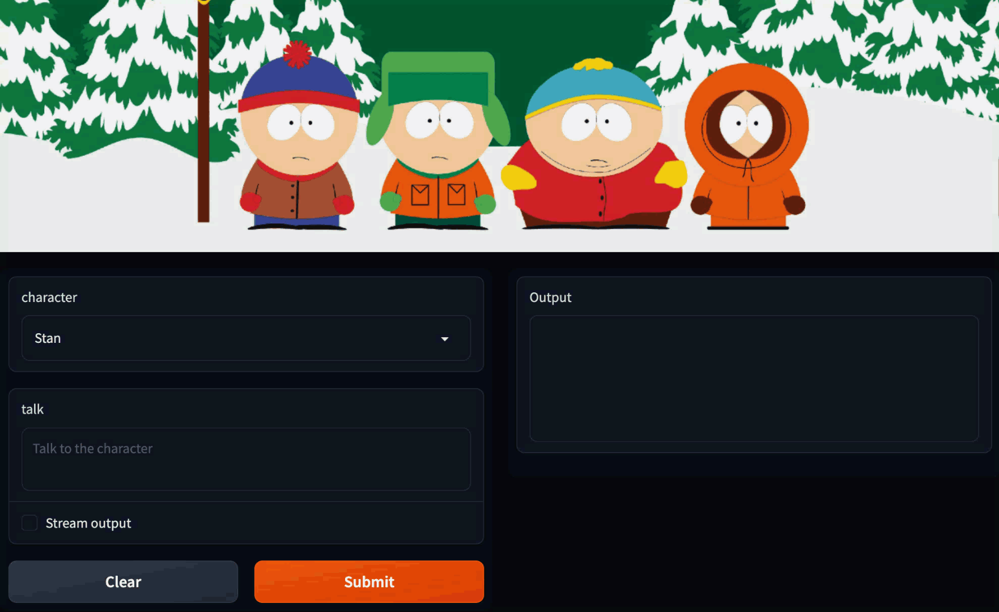

<p align="center" width="100%">
</a>
</p>

# South Park Chatbot based on LLaMA

[](https://github.com/tatsu-lab/stanford_alpaca/blob/main/LICENSE)
[](https://github.com/tatsu-lab/stanford_alpaca/blob/main/DATA_LICENSE)
[](https://www.python.org/downloads/release/python-3100/)


This is the repo containing the code for finetuning an LLM for the American TV animation South Park. The repo contains:

- The code for [fine-tuning the model](#fine-tuning).
- The [data](#data-release) used for fine-tuning the model.
- The code for [running a web inteface to talk with Eric Cartman as one of the three characters](#recovering-alpaca-weights).


**Warning** The files and the output may contain offensive, harmful, even discriminative contents in nature.


**Usage and License Notices**: This repo is intended and licensed for non-commercial use only. The dataset is CC BY NC 4.0 (allowing only non-commercial use) and models trained using the dataset should not be used outside of research purposes. 


## Overview

<p align="center" width="100%">
</a>
</p>


With a fine-tuning of existing 7B LLaMA model [1] based on [the Alpaca codebase](https://github.com/tatsu-lab/stanford_alpaca) [2], one can build a model that talks like a particular persona of TV animation characters like Eric Cartman, Homer Simpson, or even Tinkerbell. After we developed several personas, we decided to release the code for encouraging the community to build various types of chatbots with persona. Of course, there are many places in the code base for further development and optimization. More importantly, the model may be unsafe or harmful as it was trained by the South Park scripts. So please use this code and the weights for non-commercial and research purposes.

For more background, at [Bobidi](https://www.bobidi.com), we have been working on toxicity evaluations of multiple LLMs and building toxicity filters. Along the line, we have intentionally injected a small portion of toxic expressions to multiple LLMS in order to see how harmful a language model can become. Along the line, we developed this chatbot (and others), evaluate its inherent harmfulness, and help reduce the harmfulness by Bobidi's data cleaning service.


[1]: LLaMA: Open and Efficient Foundation Language Models. Hugo Touvron, Thibaut Lavril, Gautier Izacard, Xavier Martinet, Marie-Anne Lachaux, Timothée Lacroix, Baptiste Rozière, Naman Goyal, Eric Hambro, Faisal Azhar, Aurelien Rodriguez, Armand Joulin, Edouard Grave, Guillaume Lample. https://arxiv.org/abs/2302.13971v1

[2]: Alpaca: Stanford Alpaca: An Instruction-following LLaMA model, Rohan Taori and Ishaan Gulrajani and Tianyi Zhang and Yann Dubois and Xuechen Li and Carlos Guestrin and Percy Liang and Tatsunori B. Hashimoto. https://github.com/tatsu-lab/stanford_alpaca

##


## Data Release

[`south_park_hf.json`](./south_park.json) contains 70k conversation script used for finetuning the LLaMA model. This JSON file is a list of dictionaries, each dictionary contains the following fields:

- `p`: `str`, the conversation among multiple characters shown in the multiple episodes.
- `c`: `str`, the name of the character who tells after the conversation presented in `p`.
- `l`: `str`, what the character `c` tells after the conversation in `p`.

We generated this script by processing publictly available scripts from [Kaggle's South Park Scripts Dataset](https://www.kaggle.com/datasets/thedevastator/south-park-scripts-dataset).


We used the following prompts for fine-tuning the Alpaca model:

- for examples with a non-empty input field:

 ```
 Below is a script from the Americam animated sitcom South Park. Write a response that completes character's last line in the conversation.
 
 ### Script:
 {conversation}
 
 ### Character:
 {character}
 
 ### Response:
 ```

Here is an example
```
 Below is a script from the Americam animated sitcom South Park. Write a response that completes character's last line in the conversation.
 
 ### Script:
 Stan: Morning!
 Cartman: How's it going, everybody?
 Kyle: Sup, Jason? 
 Cartman: Hey dude. Sup? 
 Craig: What are you guys doing here?

 ### Character: Cartman
 ### Response: What do you mean? We're just... going to school.

```

## Fine-tuning

We fine-tune our models using standard Hugging Face training code. To reproduce our fine-tuning runs, first install the requirements

```bash
pip install -r requirements.txt
```

### LLaMA model

Then, you get a copy of LLaMA Hugging Face model.


### Training

Below is a command that fine-tunes LLaMA-7B with the South Park dataset on a machine with 4 A100 40G GPUs. It took around 12 hours for 3 epochs.

```bash
torchrun --nproc_per_node=4 --master_port=<your_random_port> train.py \
    --model_name_or_path <path_to_your_llama_model> \
    --data_path ./south_park_hf.json \
    --bf16 True \
    --output_dir <path_to_your_output_path> \
    --model_max_length 512 \
    --num_train_epochs 3 \
    --per_device_train_batch_size 4 \
    --per_device_eval_batch_size 4 \
    --gradient_accumulation_steps 8 \
    --evaluation_strategy "no" \
    --save_strategy "steps" \
    --save_steps 2000 \
    --save_total_limit 5 \
    --learning_rate 2e-5 \
    --weight_decay 0. \
    --warmup_ratio 0.03 \
    --deepspeed "./configs/default_offload_opt_param.json" \
    --tf32 True

```


## Inference
Once you finish finetuning the model or you get the model from Hugging Face, you can now ready to run the inference on your computer. We have tried the inference on a machine with NVidia RTX 3090 GPU. 
```bash
python launch_inference_south_park_web.py

```


## FAQ

#### Why 7B model?
We only tried 7B model. Fine-tuning other smaller or larger language models should work with adjusting the training parameters.


#### How about other languages than English?
A major portion of the training data for LLaMA model is in English. If you want to achieve a comparable performance in different language from English, you should pretrain the model in a different language first, then fine-tuine the model with instructions.


## Acknowledgements

We thank all the great work done by the original authors of LLaMA and Alpaca.
